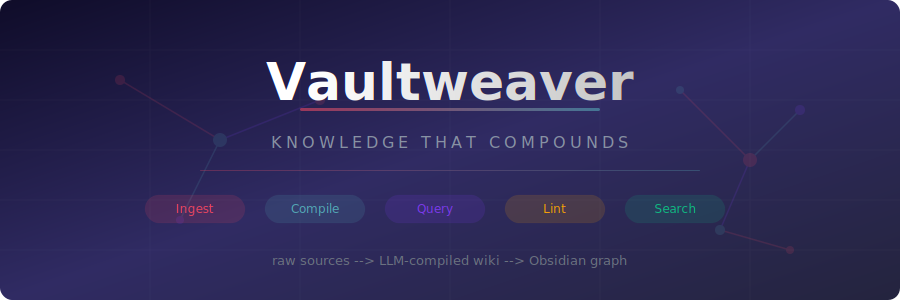
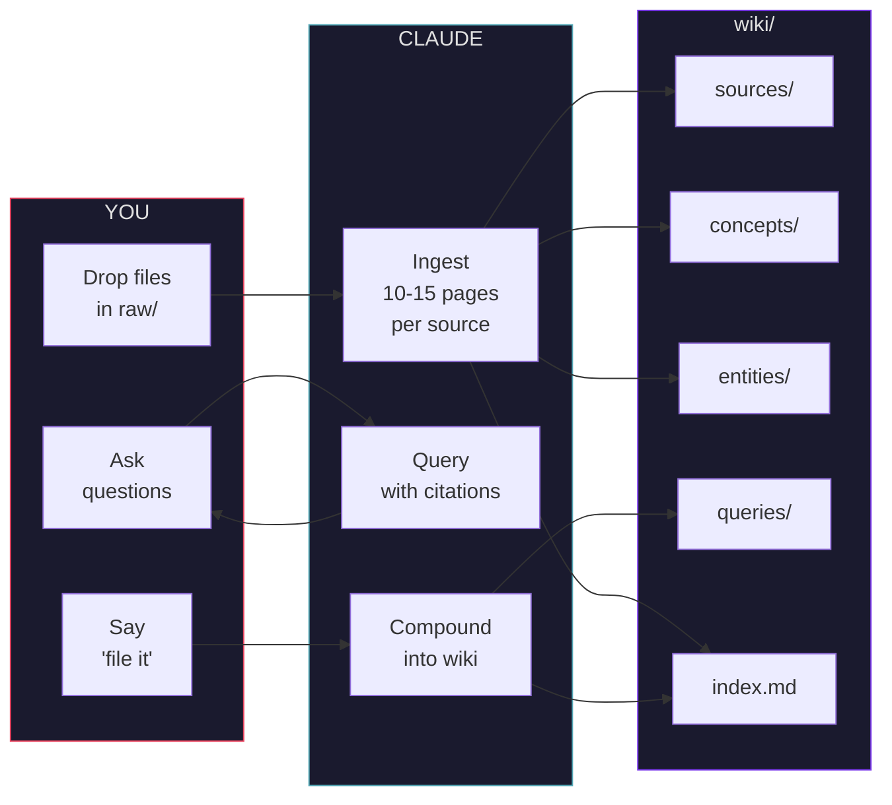
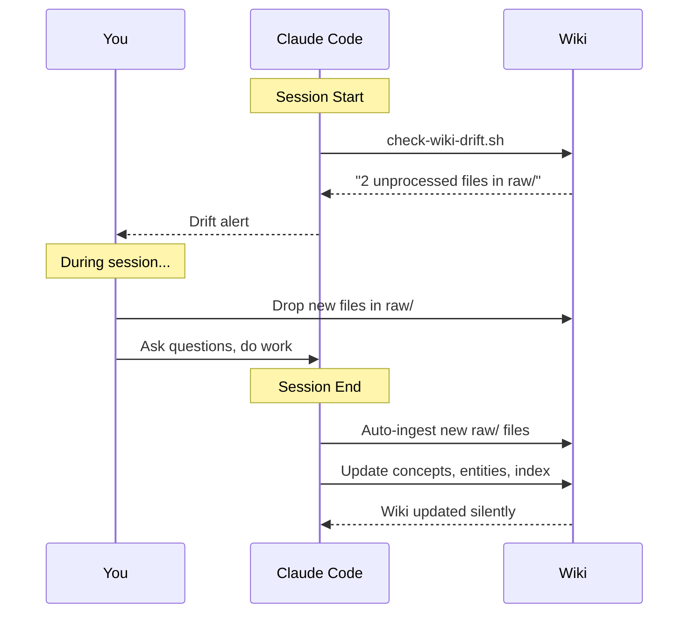
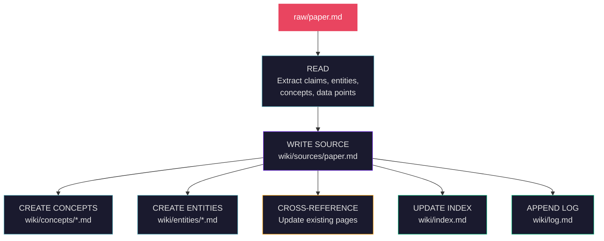

<div align="center">



<br/>
<br/>

<p>
  <a href="LICENSE"></a>&nbsp;
  <a href="https://claude.ai/claude-code"></a>&nbsp;
  <a href="https://obsidian.md"></a>&nbsp;
  <a href="https://x.com/karpathy/status/2039805659525644595"></a>
</p>

<br/>

<p><strong>Your research disappears into chat sessions. Vaultweaver makes it compound.</strong></p>

<p>
  <a href="#install">Install</a>&nbsp;&nbsp;&bull;&nbsp;&nbsp;
  <a href="#quick-start">Quick Start</a>&nbsp;&nbsp;&bull;&nbsp;&nbsp;
  <a href="#how-it-works">How It Works</a>&nbsp;&nbsp;&bull;&nbsp;&nbsp;
  <a href="#commands">Commands</a>&nbsp;&nbsp;&bull;&nbsp;&nbsp;
  <a href="#why-not-rag">Why Not RAG?</a>
</p>

</div>

<br/>

## The Idea

> *"A large fraction of my recent token throughput is going less into manipulating code, and more into manipulating knowledge."*
>
> -- **Andrej Karpathy**, [April 2026](https://x.com/karpathy/status/2039805659525644595)

Karpathy described a pattern: collect raw sources, have an LLM **compile** them into an interconnected wiki, then query and refine it over time. The wiki becomes a **persistent, compounding artifact** -- not a throwaway chat response.

**Vaultweaver is that pattern, packaged as a Claude Code skill.**

<br/>

## What Makes It Different

<table>
<tr>
<td width="50%">

### Without Vaultweaver

- Chat answers vanish after the session
- 20 papers = 20 isolated summaries
- Re-explain context every conversation
- No cross-references between ideas
- Knowledge doesn't compound

</td>
<td width="50%">

### With Vaultweaver

- Knowledge persists as markdown files
- 20 papers = interconnected knowledge graph
- Wiki provides full context automatically
- `[[wiki-links]]` connect everything
- Every source makes the whole wiki richer

</td>
</tr>
</table>

<br/>

## Install

```bash
git clone https://github.com/Apexlify/cursor-Workspace.git
cd cursor-Workspace/vaultweaver
bash install.sh
```

**That's it.** Start a new Claude Code session and you have `/wiki`.

<details>
<summary>&nbsp;<b>Manual install</b></summary>

<br/>

```bash
cp -r . ~/.claude/skills/vaultweaver
cp SKILL.md ~/.claude/commands/wiki.md
```

</details>

<br/>

## Quick Start

```
/wiki init "My Research"
```

Drop files into `raw/` -- papers, articles, notes, screenshots, anything.

```
/wiki ingest
/wiki compile
/wiki query "How does X relate to Y?"
```

Or skip the commands -- just talk:

> *"I dropped 3 papers in raw, process them"*<br/>
> *"What do we know about attention scaling?"*<br/>
> *"Check the wiki for issues"*

Vaultweaver triggers automatically.

<br/>

## How It Works



### The Three Layers

| Layer | What | Owner |
|:------|:-----|:------|
| **`raw/`** | Source documents -- papers, articles, notes, images | **You** *(immutable)* |
| **`wiki/`** | Compiled knowledge -- summaries, concepts, entities, queries | **Claude** *(writes everything)* |
| **`SKILL.md`** | Schema -- conventions, triggers, workflows | **Vaultweaver** |

<br/>

## Commands

<table>
<tr>
<th>Command</th>
<th>Description</th>
<th align="center">LLM</th>
</tr>
<tr>
<td><code>/wiki init "Topic"</code></td>
<td>Create wiki structure</td>
<td align="center">--</td>
</tr>
<tr>
<td><code>/wiki ingest</code></td>
<td>Process raw/ sources -- <b>10-15 pages per source</b></td>
<td align="center">Yes</td>
</tr>
<tr>
<td><code>/wiki compile</code></td>
<td>Build missing concept + entity articles</td>
<td align="center">Yes</td>
</tr>
<tr>
<td><code>/wiki query "Q"</code></td>
<td>Answer from wiki with <code>[[citations]]</code></td>
<td align="center">Yes</td>
</tr>
<tr>
<td><code>/wiki lint</code></td>
<td>Find broken links, gaps, contradictions</td>
<td align="center">Yes</td>
</tr>
<tr>
<td><code>/wiki search "term"</code></td>
<td>BM25 ranked search (instant, local)</td>
<td align="center">--</td>
</tr>
<tr>
<td><code>/wiki status</code></td>
<td>File counts + recent activity</td>
<td align="center">--</td>
</tr>
<tr>
<td><code>/wiki serve</code></td>
<td>Web search UI on localhost:5000</td>
<td align="center">--</td>
</tr>
</table>

<br/>

## Auto-Pilot

Two hooks run automatically -- zero commands needed:



<br/>

## The Ingest Pipeline

Each source goes through a **7-step pipeline**, touching 10-15 wiki pages:



> **Why 10-15 pages?** A paper mentions dozens of concepts. If you only write a summary, you get an isolated note. Create concept pages, entity pages, and cross-references, and you get a **knowledge graph** where every future source plugs into existing connections. **Your 20th paper is 10x more valuable than your 1st.**

<br/>

## Querying

```
User: /wiki query "What are the tradeoffs between
       exact and approximate attention?"

Claude: Based on [[concepts/flash-attention]],
        [[concepts/linformer]], and [[concepts/performer]]:

        | Method          | Exact? | Complexity | Memory |
        |-----------------|--------|------------|--------|
        | Full attention  | Yes    | O(n^2)     | O(n^2) |
        | Flash Attention | Yes    | O(n^2)     | O(n)   |
        | Linformer       | No     | O(n)       | O(n)   |
        | Performer       | No     | O(n)       | O(n)   |

        Want me to file this into the wiki?

User: yes

Claude: --> wiki/queries/exact-vs-approximate-attention.md
```

> **Filed answers compound.** Next time you query about attention, this synthesis is already part of the wiki.

<br/>

## Health Checks

`/wiki lint` runs **seven checks**:

<table>
<tr><th>Check</th><th>What it finds</th><th align="center">Auto-fix?</th></tr>
<tr><td><b>Contradictions</b></td><td>Conflicting claims across pages</td><td align="center">Reports for judgment</td></tr>
<tr><td><b>Stale claims</b></td><td>Superseded by newer sources</td><td align="center">Partial</td></tr>
<tr><td><b>Orphan pages</b></td><td>No inbound <code>[[links]]</code></td><td align="center">Adds cross-refs</td></tr>
<tr><td><b>Missing concepts</b></td><td>Mentioned often, no article</td><td align="center">Creates stubs</td></tr>
<tr><td><b>Broken links</b></td><td><code>[[links]]</code> to non-existent pages</td><td align="center">Creates stubs</td></tr>
<tr><td><b>Data gaps</b></td><td>Partially covered topics</td><td align="center">Suggests sources</td></tr>
<tr><td><b>Thin pages</b></td><td>Too little content</td><td align="center">Partial</td></tr>
</table>

> **Lint tells you what to research next.** It turns the wiki from a static collection into a research roadmap.

<details>
<summary>&nbsp;<b>Link normalization rules</b></summary>

<br/>

All of these resolve to the same page:

| Input | Resolves to |
|:------|:-----------|
| `[[gpt-series]]` | `gpt-series.md` |
| `[[GPT_series]]` | `gpt-series.md` |
| `[[GPT Series]]` | `gpt-series.md` |
| `[[concepts/gpt-series]]` | `gpt-series.md` |
| `[[gpt-series\|GPT Family]]` | `gpt-series.md` |

</details>

<br/>

## BM25 Search

Instant local search -- no LLM, no API calls:

```bash
python search.py wiki/ "attention mechanism"       # CLI search
python search.py wiki/ --json "transformer"        # JSON output
python search.py wiki/ --serve                     # Web UI
python search.py wiki/ --stats                     # Index stats
```

Web UI at `localhost:5000` -- dark theme, score badges, click-through to pages.

<br/>

## Why Not RAG?

<table>
<tr><th></th><th>RAG</th><th>Vaultweaver</th></tr>
<tr><td><b>Structure</b></td><td>Flat chunks in a vector DB</td><td>Interconnected <code>[[wiki-links]]</code> graph</td></tr>
<tr><td><b>Cross-refs</b></td><td>None -- chunks are isolated</td><td>Every page links to related pages</td></tr>
<tr><td><b>Contradictions</b></td><td>Hidden (chunks conflict silently)</td><td>Explicitly noted in articles</td></tr>
<tr><td><b>Compounding</b></td><td>Each query starts from scratch</td><td>Answers filed back improve future queries</td></tr>
<tr><td><b>Browsability</b></td><td>Need a special UI</td><td>Open in Obsidian or any editor</td></tr>
<tr><td><b>Infrastructure</b></td><td>Vector DB + embeddings</td><td>Plain markdown files</td></tr>
<tr><td><b>Best for</b></td><td>1K-1M documents</td><td>10-500 sources (personal research)</td></tr>
</table>

<br/>

<div align="center">
<b>RAG retrieves. Vaultweaver compiles.</b>
</div>

<br/>

## Wiki Structure

```
my-project/
|
|-- raw/                         You own this (immutable)
|   |-- paper-on-transformers.md
|   |-- blog-post-on-bert.md
|   +-- architecture-diagram.png
|
|-- wiki/                        Claude owns this
|   |-- index.md                 Categorized page catalog
|   |-- log.md                   Parseable activity log
|   |-- overview.md              High-level synthesis
|   |-- schema.md                Wiki conventions
|   |-- sources/                 One summary per raw file
|   |-- concepts/                Encyclopedic articles
|   |-- entities/                People, orgs, tools
|   +-- queries/                 Filed Q&A
|
+-- search.py                    BM25 search engine
```

<br/>

## Obsidian Integration

Open `wiki/` in Obsidian for:

<table>
<tr>
<td width="50%">

**Graph View** -- visual knowledge map showing all concepts and their `[[connections]]`

**Backlinks** -- every page shows what links to it

</td>
<td width="50%">

**Live Reload** -- watch the wiki grow as Claude writes pages

**Dataview** -- query YAML frontmatter across all pages

</td>
</tr>
</table>

Every page has structured frontmatter:

```yaml
---
title: "Self-Attention"
type: concept
tags: [attention, mechanism, transformer]
created: 2026-04-07
sources: [raw/transformers.md, raw/bert-paper.md]
---
```

<br/>

## Page Conventions

| Element | Convention |
|:--------|:----------|
| **Wikilinks** | `[[hyphenated-lowercase]]` -- link liberally |
| **First paragraph** | 1-2 sentence summary of the page |
| **Citations** | `According to [[sources/paper-name]]...` |
| **Contradictions** | Always noted explicitly, never silently resolved |
| **Sources section** | Every concept/entity page ends with `## Sources` |
| **Log entries** | `## [YYYY-MM-DD] operation \| title` -- parseable with grep |

<br/>

## Repo Structure

```
vaultweaver/
|-- SKILL.md               The brain: triggers, decision tree, operations
|-- hooks.json             Auto-pilot: Stop + SessionStart hooks
|-- settings.json          Registry metadata: name, version, tags
|-- scripts/
|   |-- check-wiki-drift.sh   Detects unprocessed raw/ files
|   +-- search.py              BM25 engine + Flask web UI
|-- references/
|   +-- operations.md          Detailed 10-step workflows
|-- assets/
|   +-- banner.svg             README header graphic
|-- install.sh             One-command install
|-- uninstall.sh           Clean removal
|-- LICENSE                MIT
+-- README.md              You are here
```

<br/>

## Uninstall

```bash
bash uninstall.sh
```

Removes the skill. **Your wiki data is never touched.**

<br/>

## Credits

<table>
<tr>
<td align="center"><a href="https://x.com/karpathy/status/2039805659525644595"><b>Andrej Karpathy</b></a><br/><sub>LLM Knowledge Bases pattern</sub></td>
<td align="center"><a href="https://github.com/toolboxmd/karpathy-wiki"><b>toolboxmd/karpathy-wiki</b></a><br/><sub>Reference implementation</sub></td>
<td align="center"><a href="https://github.com/alirezarezvani/claude-skills"><b>alirezarezvani/claude-skills</b></a><br/><sub>Skill conventions</sub></td>
</tr>
</table>

<br/>

---

<div align="center">

<br/>

**If this is useful, give it a star.**

*Built with Claude Code. Viewed in Obsidian. Knowledge that compounds.*

<br/>

</div>
